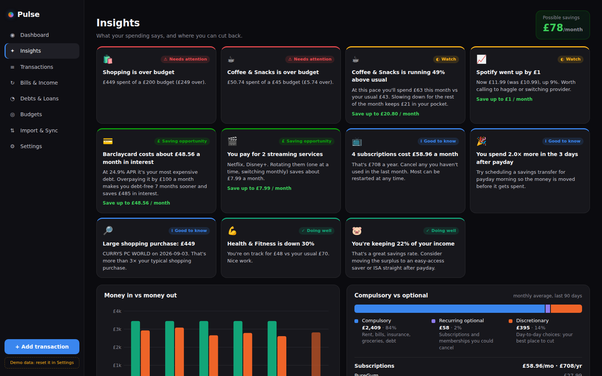
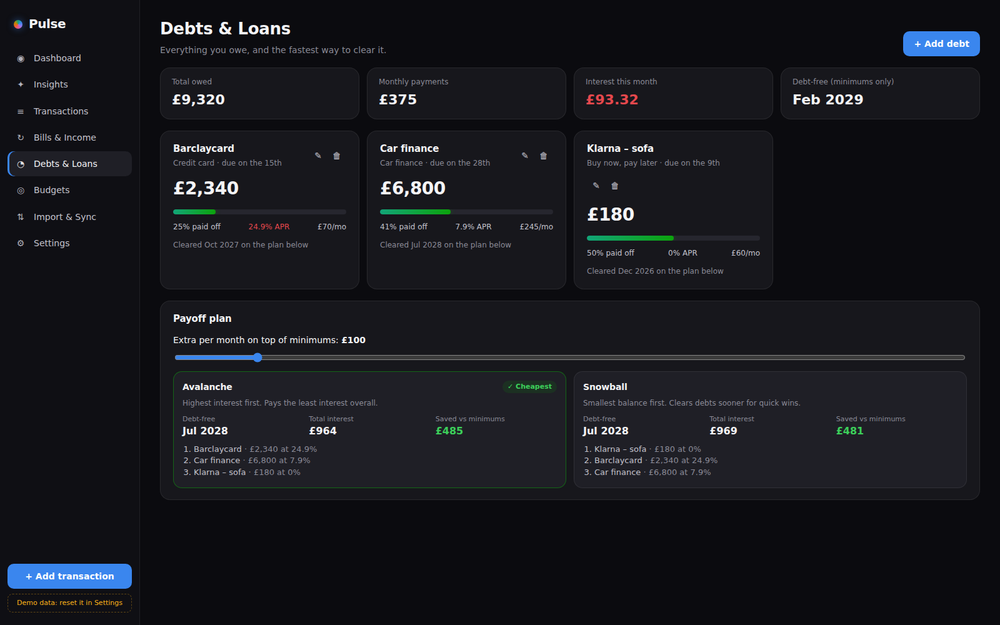
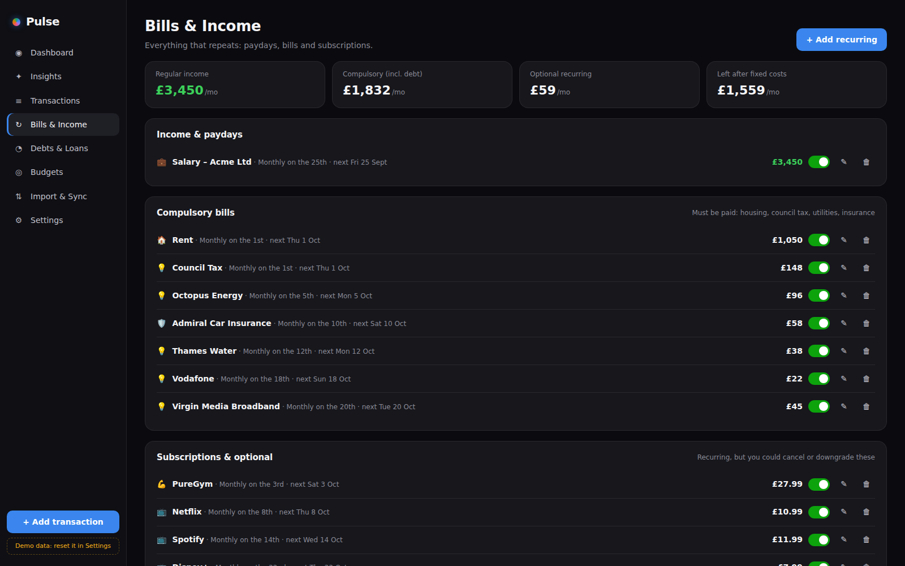

# Pulse Finance

A personal finance tracker for Windows that works like a fitness tracker for your money. The dashboard is dark, with glowing category meters and a payday calendar. It keeps track of bills, loans and subscriptions, and an insights engine tells you where you can cut back.


## What it does

| | |
|---|---|
| **Dashboard** | A large "left to spend" ring (*Income − Spent − Bills still to pay = Left*), laid out like MyFitnessPal's calories-remaining screen. Below it are bright meters for each category, measured against your budget or your 3-month average. Stat tiles show days until payday, how much is safe to spend per day, and your total debt. |
| **Payday calendar** | A month grid from the 1st to the 30th/31st. Colours and icons mark paydays (glowing green), money in, bills, subscriptions, debt payments and savings. A bar under each day shows day-to-day spending. Paid items get a ✓, and bills not yet seen on a statement are outlined. Click any day for the details. |
| **Paydays done properly** | Pay on a fixed date, the last working day, or every 4 weeks. Weekends and **England & Wales bank holidays** are handled, so the 25th falling on a Sunday means you're paid on Friday the 23rd. |
| **Bills & Income** | Recurring payments grouped as **compulsory** (rent, council tax, utilities) or **optional** (subscriptions you could cancel). The app finds these in your statements automatically and suggests tracking them. |
| **Debts & Loans** | Credit cards, loans, car finance, BNPL and money owed to people. Shows interest cost and progress bars, plus an **avalanche vs snowball** payoff plan with a slider for extra monthly payments. |
| **Insights** | Spending-pace warnings ("Eating Out is running 45% above usual"), budget overruns, price rises on subscriptions, streaming overlap, frequent small purchases (the "latte factor"), payday spending spikes, unusually large purchases, savings rate, the 50/30/20 check, interest-cost tips, 6-month trends and top merchants. |
| **Desktop widget** | A small frameless card you can drag anywhere on the desktop. It shows your left-to-spend ring, payday countdown, top category bars and the next bills. It can stay on top of other windows, and its opacity is adjustable. |
| **Tray and reminders** | Keeps running in the system tray and sends Windows notifications for bills due tomorrow, payday, and bank consent about to expire. It can start with Windows. |

<p>
  
  
</p>
<p>
  
  
</p>

## Getting transactions in (all read-only)

1. **CSV import.** Handles statement exports from Monzo, Starling, Revolut, Barclays, HSBC, Lloyds/Halifax, Nationwide, Santander, NatWest, Chase UK, Amex and most EU banks. It reads UK day-first dates, `£1,234.56` and European `1.234,56` amounts, split paid-in/paid-out columns, and header rows below preamble lines. Overlapping statements never create duplicates.
2. **Auto-import folder.** Point the app at a folder. Any bank CSV saved there is imported and categorised within seconds, even while the app is in the tray. Files that aren't bank statements are ignored.
3. **Open Banking.** Connects to your bank through [GoCardless Bank Account Data](https://bankaccountdata.gocardless.com/) (formerly Nordigen), a regulated UK/EU account-information service. The access is **read-only by law**: balances and transactions only, never payments. Your bank asks you to re-approve every 90 days, and the app syncs up to 4 times a day. You bring your own free API keys, which are stored encrypted with Windows DPAPI. When a bank is connected, "safe to spend" uses your real balance.
   > GoCardless has changed its sign-up availability in the past. If new accounts aren't being accepted, options 1 and 2 still work fully, and the connector (`electron/openbanking.js`) is self-contained, so another provider (TrueLayer, Yapily, Plaid UK) can replace it.

Transactions are auto-categorised using a list of UK merchants (Tesco, TfL, Octopus, Deliveroo, Netflix…). When you change a transaction's category, the app **learns** that merchant and re-files its other transactions.

## Install and run

**Download the installer:** every push to `main` runs the GitHub Actions workflow *Build Windows app*, which uploads `Pulse Finance Setup x.y.z.exe` (installer) and a portable `.exe` as build artifacts.

**Build it yourself on Windows** (Node.js 20+):

```bash
npm install
npm start          # build the UI and launch the app
npm run dist       # create the Windows installer in release/
```

**Development:**

```bash
npm run dev        # Vite dev server + Electron with hot reload
npm run dev:web    # UI only, in a browser (data saved in localStorage)
npm test           # engine unit tests
```

On first launch, choose **Explore with demo data** to see every screen populated, or **Set up my finances** to enter your pay and rent. Reset the demo data in Settings.

## Your data

Everything stays on your PC in `%APPDATA%\Pulse Finance\`:

- `pulse-data.json`: your data. Written atomically, with a daily backup kept for 14 days in `backups\`. If the file is ever damaged, the latest backup is restored automatically.
- `secrets.json`: Open Banking keys, encrypted with Windows DPAPI.
- Export and restore a full backup from Settings.

## How it's built

```
src/engine/      Pure JS core, shared by the app, the background process and the tests
  dates.js         ISO dates, working days, UK bank holidays
  csv.js           bank statement parser
  categories.js    categories, UK merchant keywords, merchant keys
  recurring.js     schedule expansion, matching bills to payments, recurring detection
  summary.js       month summary: rings, meters, calendar days, safe-to-spend
  insights.js      insight rules, trends, compulsory/optional split
  debt.js          avalanche/snowball payoff simulation
  state.js         data model and the single reducer every change goes through
src/renderer/    React UI (dashboard, pages, widget)
electron/        main process: windows, tray, widget, IPC, store, folder watcher, Open Banking, reminders
```

Security: `contextIsolation`, `sandbox` and no Node.js in the renderer. The UI reaches the system only through a narrow preload API, the production build has a strict Content-Security-Policy, and only https links can be opened externally.

Design references: the calorie-ring dashboard follows **MyFitnessPal/Yazio**. Budgets and "every pound has a job" follow **YNAB**. Recurring detection and subscription tracking are inspired by **Rocket Money** and the UK apps **Emma** and **Snoop**. The insight cards follow **Copilot Money**, and the avalanche/snowball planner is the standard method from **Undebt.it**.

## Ideas for next steps

- Savings goals (holiday, emergency fund) as extra rings
- Pay-cycle view (25th to 24th) as an alternative to calendar months
- Split transactions, and tags such as "holiday"
- An optional "Ask my finances" chat using your own AI API key
- Receipt/PDF statement import
