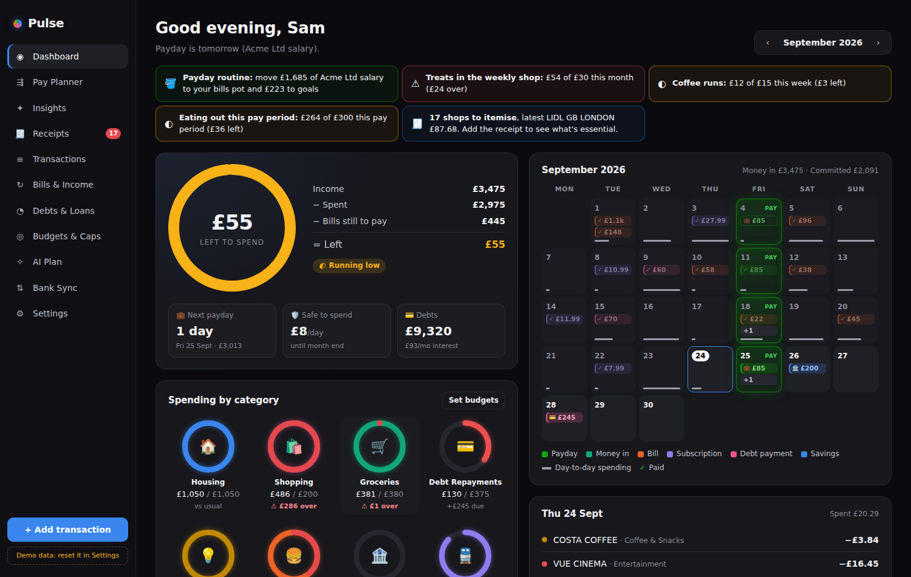
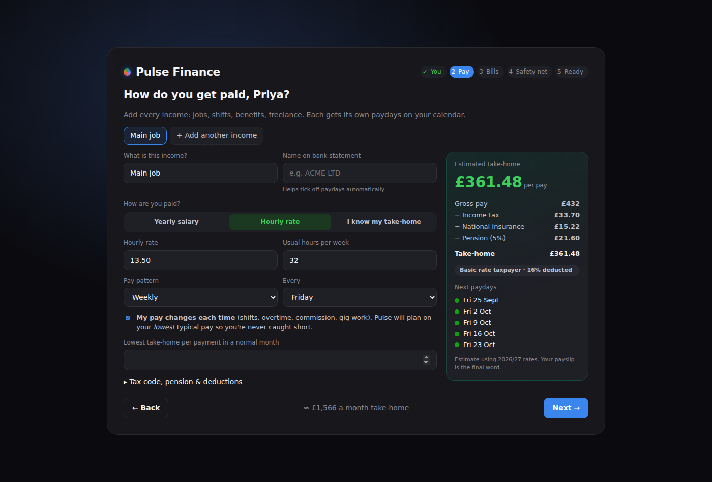
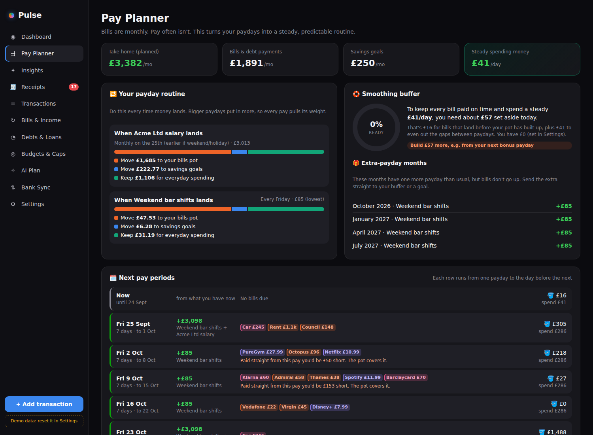
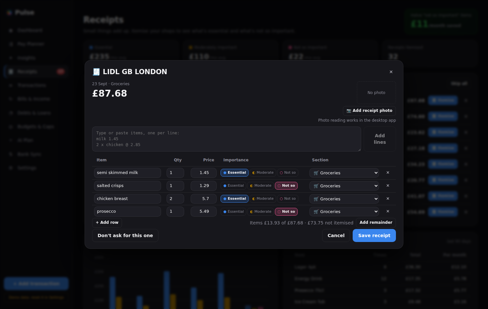
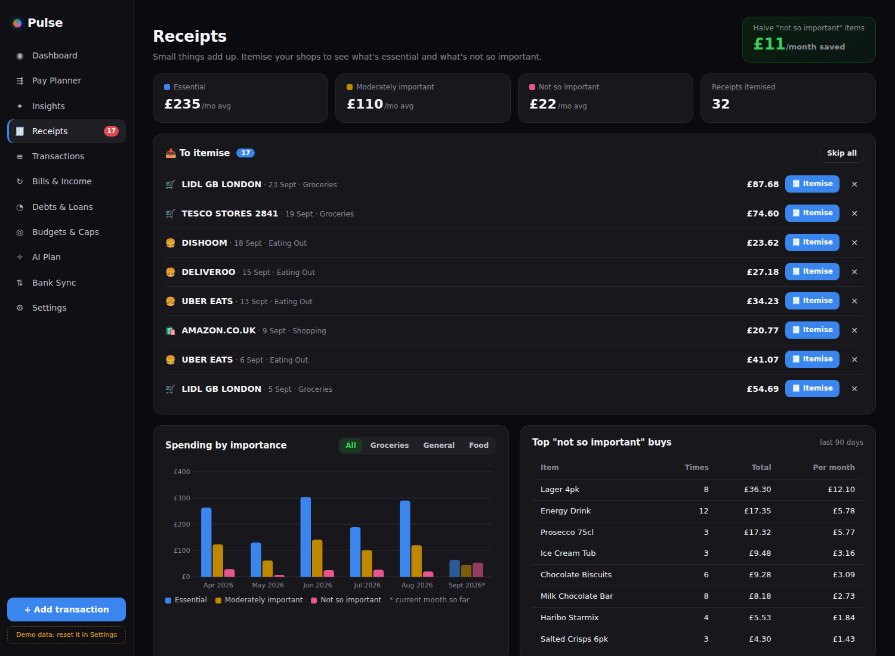
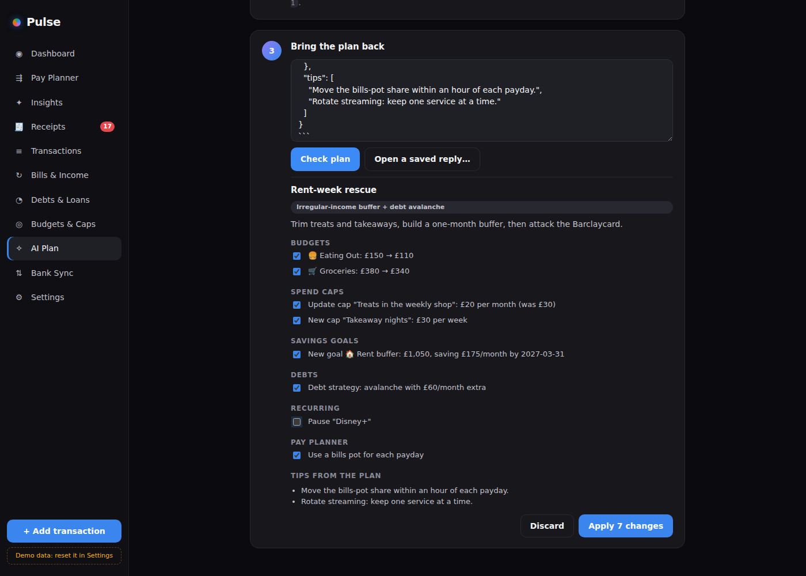
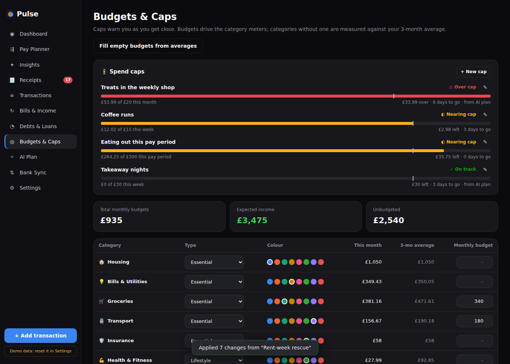
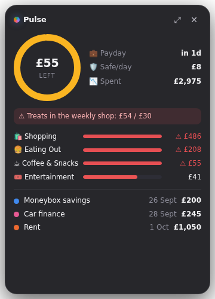

# Pulse Finance

A friendly personal finance app for Windows, built around **your** paydays. You might be paid monthly, weekly every Friday, every other week, on the last working day, or whenever the work comes in. Pulse turns that into a calendar, a steady spending allowance, and bills that never catch you out.



## Highlights

| | |
|---|---|
| **A personal setup wizard** | Five short steps: your name and tax region, how you're paid, your regular bills, a safety net, and a personalised summary. Anything can be changed later in **Settings → Profile & Pay**. |
| **Real UK take-home pay** | Enter a salary, an hourly rate or a known take-home amount. Pulse applies your **tax code** (1257L, BR, D0, K-codes, NT, S-prefix), **Scottish bands**, **National Insurance**, **pension** (net pay, salary sacrifice or relief at source), **student loans** (Plans 1, 2, 4 and 5, and Postgrad) and any other deductions. You see the payslip-style breakdown update live as you type. |
| **Every pay pattern** | Monthly on a set date (moved earlier for weekends and bank holidays), the last working day, the last Friday (or any weekday) of the month, weekly, fortnightly, four-weekly, or irregular. Add as many incomes as you have; each gets its own paydays on the calendar. |
| **Built for irregular pay** | Tick "my pay changes" and Pulse plans on your **lowest** typical pay. The **Pay Planner** gives each payday a routine: move £X to your bills pot, £Y to goals, keep the rest. It spreads monthly bills across weekly or fortnightly pay in proportion to each payday's size, and works out the **smallest starting buffer** that keeps every bill paid. It also gives a **steady daily spending allowance**, flags weeks that would be short without the pot, and lists months with an **extra payday** so you can bank the bonus. |
| **Receipts and item importance** | When a supermarket or shopping payment comes in (Aldi, Lidl, Tesco and so on), Pulse offers to itemise it. Snap a **photo of the receipt**, read by OCR **fully offline** on your PC, or type lines like `milk 1.45` / `2 x chicken @ 2.85`. Each item is rated **Essential**, **Moderately important** or **Not so important**, and put in a **Groceries**, **General** or **Food out** section. Pulse learns from your choices, then shows monthly trends by importance and your top "not so important" buys. |
| **Spend caps with alerts** | Cap a category, an importance tier ("not-so-important groceries ≤ £30/month"), a receipt section or all spending, **per month, week or pay period**. Pulse warns you on the dashboard, the widget and through Windows notifications when you reach a threshold you choose, and again when you go over. |
| **AI plan: bring your own assistant** | Copy a ready-made prompt with an anonymised summary of your finances into ChatGPT, Claude, Gemini or Copilot. Its reply contains a strict **Pulse Plan** JSON. Paste it back: Pulse validates it, shows every change with a checkbox (budgets, caps, savings goals, debt strategy, subscriptions to pause, bills pot), applies only what you tick, and keeps an **undo** history. |
| **Everything from v1** | Glowing category meters, payday calendar, bills (compulsory vs optional), auto-detected subscriptions, debts with avalanche/snowball planning, insights, desktop widget, tray and reminders. |

<p>
  
  
</p>
<p>
  
  
</p>
<p>
  
  
</p>
<p></p>

## Getting transactions in (read-only)

1. **Bank connection (Open Banking), recommended.** Pulse connects through **[Enable Banking](https://enablebanking.com/)**, a regulated provider covering 2,500+ UK and EU banks. It's free for personal use in *restricted* mode, where you link your own accounts to your own app. The access is read-only by law, and Pulse syncs up to 4 times a day. Your application key is encrypted with Windows DPAPI.
   - Setup: create an application at enablebanking.com, add the redirect URL `http://localhost:47285/callback`, download the `.pem` key, link your accounts in their control panel, then enter the App ID and key in **Bank Sync**. If your bank sends you back to a page that doesn't load, paste its address into Pulse and it will finish the connection.
   - *Why not GoCardless?* GoCardless Bank Account Data (formerly Nordigen) stopped accepting new sign-ups in July 2025 and is being wound down, so v0.2 replaces it.
2. **Watched folder.** Any bank CSV saved to a folder you choose is imported automatically, even while Pulse is in the tray.
3. **Statement file.** Import a CSV by hand, from almost any UK/EU bank.

These fallbacks stay because Open Banking depends on a third party and on each bank's consent rules. They live under *Bank Sync → Other ways*, out of the everyday flow. The same payment arriving by two routes is de-duplicated.

## Install and run

Every push to `main` and every pull request runs the *Build Windows app* workflow, which uploads the installer and a portable `.exe` as build artifacts. To build it yourself on Windows (Node.js 20+):

```bash
npm install
npm start          # build the UI and launch
npm run dist       # Windows installer + portable exe in release/
npm test           # 37 engine and connector tests
npm run dev        # hot-reload development
```

## Your data and privacy

Everything stays on your PC in `%APPDATA%\Pulse Finance\`:

- `pulse-data.json`: your data, written atomically, with daily backups kept for 14 days and automatic recovery.
- `receipts\`: your receipt photos. OCR runs locally, and the English model ships with the app.
- `secrets.json`: bank keys, encrypted with DPAPI.

The AI prompt contains a summary (pay, bills, debts, category averages, caps, goals). It **leaves out** your name, account details and individual transactions. Nothing is sent anywhere unless you paste it yourself.

## How it's built

```
src/engine/            Pure JS core shared by the app, the background process and the tests
  payroll.js             UK PAYE/NI/pension/student loan take-home (rates table in one place)
  income.js              pay profile -> paydays for every pay pattern
  planner.js             pay-period planner: bills pot, smoothing buffer, allowance, bonus paydays
  receipts.js            receipt text parser, importance tiers, basket analytics
  caps.js                spend caps per month / week / pay period
  aiplan.js              AI prompt builder + Pulse Plan v1 validator, diff, apply and undo
  summary.js, recurring.js, insights.js, debt.js, csv.js, categories.js, dates.js, state.js
src/renderer/          React UI (pages, widget, onboarding)
electron/              main process, secure preload bridge, store, folder watcher, OCR, reminders
electron/connectors/   read-only data connectors (Enable Banking today)
```

Tax rates live in `TAX_YEAR` in `payroll.js`. rUK income tax thresholds and NI are frozen, so 2026/27 matches 2025/26. Scottish bands and student-loan thresholds are the 2025/26 figures and should be checked each April.

## Room to grow (V3)

The code is structured so that portfolio features can be added without reworking the app:

- **Connectors** (`electron/connectors/`) share one interface (`info / saveCredentials / connect / sync / disconnect`). They are read-only by design, so a broker, crypto exchange or fund-platform connector slots in next to Enable Banking. Anything that moves money (trades, SIP/SWP execution) is meant to be a separate, explicitly confirmed capability.
- **SIPs and SWPs** can already be tracked as recurring payments ("Investment (SIP)" and "Investment withdrawal (SWP)").
- The data schema is versioned (v2) and reserves a `portfolio` section. The Pulse Plan format rejects investment instructions for now, with a clear message.
